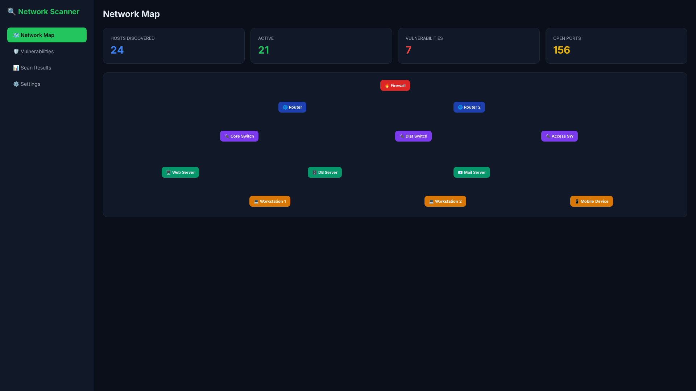
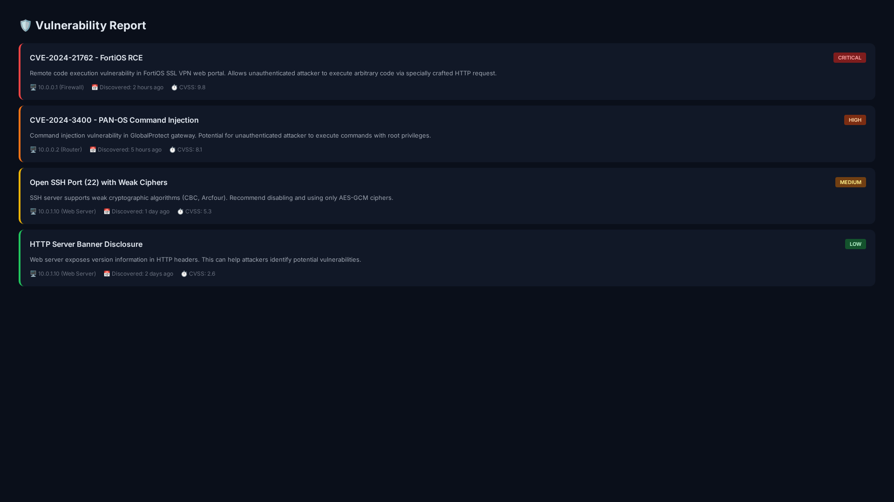
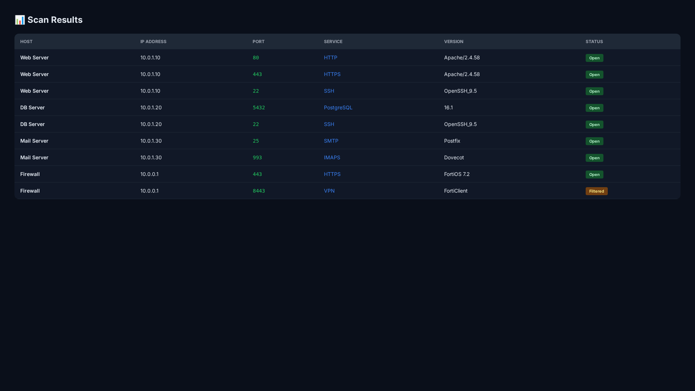

<div align="center">

  

  # 🔍 Network Scanner

  **AI-Powered Network Scanner & Vulnerability Assessment Tool**

  Comprehensive network discovery and security scanning with intelligent vulnerability detection

  [](https://opensource.org/licenses/MIT)
  [](https://www.python.org/)
  [](https://react.dev/)
  [](https://nmap.org/)
  [](https://www.docker.com/)

  [Features](#-features) • [Quick Start](#-quick-start) • [Architecture](#-architecture) • [API](#-api-reference) • [Contributing](#-contributing)

</div>

---

## 📸 Screenshots

<div align="center">

| Network Map | Vulnerability Report | Scan Results |
|-------------|---------------------|--------------|
|  |  |  |

</div>

> 💡 **Tip:** Network Scanner uses AI to intelligently prioritize and categorize vulnerabilities

---

## ✨ Features

| Feature | Description |
|---------|-------------|
| 🔍 **Network Discovery** | Automatic host and service detection |
| 🛡️ **Vulnerability Scanning** | CVE detection and risk assessment |
| 🤖 **AI Analysis** | Intelligent vulnerability prioritization |
| 📊 **Visual Reports** | Interactive network maps and charts |
| 📈 **Historical Tracking** | Track changes over time |
| 🔌 **REST API** | Full programmatic access |
| 🐳 **Docker Ready** | One-command deployment |
| 📱 **Web Dashboard** | Modern, responsive UI |

---

## 🚀 Quick Start

### Prerequisites

- Docker & Docker Compose
- Git
- Network access to target systems

### Installation

```bash
# Clone the repository
git clone https://github.com/OneByJorah/Network-Scanner.git
cd Network-Scanner

# Start with Docker
docker compose up -d
```

### Access the Dashboard

Open **http://localhost:3000** in your browser

### CLI Usage

```bash
# Scan a network
python scanner.py --target 192.168.1.0/24

# Scan specific ports
python scanner.py --target 192.168.1.1 --ports 80,443,22

# Generate report
python scanner.py --target 192.168.1.0/24 --output report.json
```

---

## 🏗️ Architecture

```
┌─────────────────────────────────────────────────────────────┐
│                   Network Scanner                           │
├─────────────────────────────────────────────────────────────┤
│                                                             │
│   ┌──────────┐      ┌──────────┐      ┌──────────────┐    │
│   │ Browser  │ ───▶ │ React    │ ───▶ │ FastAPI      │    │
│   │   SPA    │ ◀─── │ Frontend │ ◀─── │ Backend      │    │
│   └──────────┘      └──────────┘      └──────┬───────┘    │
│                                               │             │
│                                   ┌───────────┴──────────┐ │
│                                   │                      │ │
│                                   ▼                      ▼ │ │
│                            ┌──────────┐          ┌──────────┐ │
│                            │  nmap    │          │ AI       │ │
│                            │  Engine  │          │ Analyzer │ │
│                            └──────────┘          └──────────┘ │
│                                                               │
│  ┌─────────────────────────────────────────────────────────┐ │
│  │                  Data Store                             │ │
│  │  ┌──────────┐  ┌──────────┐  ┌──────────┐             │ │
│  │  │ SQLite   │  │ CVE      │  │ Reports  │             │ │
│  │  │ Results  │  │ Database │  │ Storage  │             │ │
│  │  └──────────┘  └──────────┘  └──────────┘             │ │
│  └─────────────────────────────────────────────────────────┘ │
│                                                               │
└─────────────────────────────────────────────────────────────┘
```

### Tech Stack

| Component | Technology |
|-----------|------------|
| **Backend** | Python 3.10+, FastAPI |
| **Frontend** | React 18, TypeScript, Tailwind CSS |
| **Scanning** | nmap, custom Python scanners |
| **AI/ML** | scikit-learn, TensorFlow |
| **Database** | SQLite / PostgreSQL |
| **Deployment** | Docker Compose |

---

## 📁 Project Structure

```
Network-Scanner/
├── backend/                  # FastAPI backend
│   ├── main.py              # Application entry
│   ├── scanners/            # Scanning engines
│   │   ├── nmap_scanner.py  # nmap wrapper
│   │   └── vuln_scanner.py  # Vulnerability scanner
│   ├── ai/                  # AI analysis
│   │   ├── analyzer.py      # Vulnerability analyzer
│   │   └── models/          # ML models
│   └── routers/             # API routes
├── frontend/                # React SPA
│   ├── src/
│   │   ├── components/      # UI components
│   │   ├── pages/           # Page components
│   │   └── hooks/           # Custom hooks
│   └── public/              # Static assets
├── cli/                     # CLI tool
│   └── scanner.py           # Command-line scanner
├── docs/                    # Documentation
│   └── screenshots/         # Dashboard screenshots
├── docker-compose.yml       # Docker deployment
└── requirements.txt         # Python dependencies
```

---

## 🔌 API Reference

### Scanning

| Endpoint | Method | Description |
|----------|--------|-------------|
| `/api/scan` | `POST` | Start new scan |
| `/api/scan/<id>` | `GET` | Get scan status |
| `/api/scan/<id>/results` | `GET` | Get scan results |
| `/api/scan/<id>/cancel` | `POST` | Cancel scan |

### Vulnerabilities

| Endpoint | Method | Description |
|----------|--------|-------------|
| `/api/vulns` | `GET` | List vulnerabilities |
| `/api/vulns/<id>` | `GET` | Get vulnerability details |
| `/api/vulns/stats` | `GET` | Vulnerability statistics |

### Reports

| Endpoint | Method | Description |
|----------|--------|-------------|
| `/api/reports` | `GET` | List reports |
| `/api/reports/<id>` | `GET` | Get report |
| `/api/reports/<id>/export` | `GET` | Export report (PDF/CSV) |

### Example Usage

```bash
# Start a scan
curl -X POST http://localhost:8000/api/scan \
  -H "Content-Type: application/json" \
  -d '{"target": "192.168.1.0/24", "scan_type": "full"}'

# Get scan results
curl http://localhost:8000/api/scan/123/results

# Get vulnerabilities
curl http://localhost:8000/api/vulns?severity=critical
```

---

## 🛠️ Development

### Local Development

```bash
# Clone the repository
git clone https://github.com/OneByJorah/Network-Scanner.git
cd Network-Scanner

# Backend setup
cd backend
python -m venv venv
source venv/bin/activate
pip install -r requirements.txt

# Start backend
uvicorn main:app --reload --host 0.0.0.0 --port 8000

# Frontend setup (new terminal)
cd ../frontend
npm install
npm run dev
```

### Running Tests

```bash
# Backend tests
cd backend
pytest

# Frontend tests
cd frontend
npm test
```

---

## 🤝 Contributing

Contributions are welcome! Please see [CONTRIBUTING.md](CONTRIBUTING.md) for guidelines.

---

## 📄 License

This project is licensed under the MIT License - see the [LICENSE](LICENSE) file for details.

---

## 🔒 Security

For security concerns, please see [SECURITY.md](SECURITY.md).

---

## 💬 Support

- 📧 Email: support@jorah.one
- 🐛 Issues: [GitHub Issues](https://github.com/OneByJorah/Network-Scanner/issues)
- 📖 Docs: [Documentation](docs/)

---

<div align="center">

  **Built with ❤️ by [Jhonattan L. Jimenez](https://github.com/OneByJorah)**

  [⬆ Back to Top](#-network-scanner)

</div>
