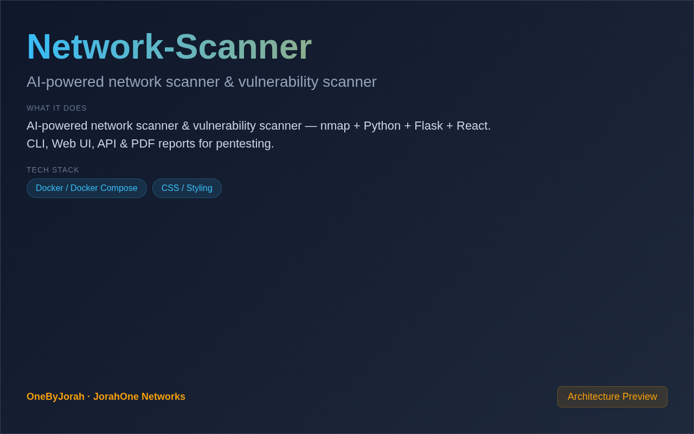

<div align="center">


# Network-Scanner

AI-powered network scanner & vulnerability scanner


</div>

---

<p align="center">
  
</p>

<br>

---

## Features

- **Network Discovery** — Automated host discovery and port scanning with nmap.
- **Vulnerability Detection** — AI-powered vulnerability prioritization and CVE matching.
- **Multiple Interfaces** — CLI, Web UI, and REST API for flexible usage.
- **PDF Reports** — Generate professional penetration testing reports.
- **Real-Time Scanning** — Live scan progress with WebSocket updates.
- **Scan History** — Track and compare scans over time.
- **Flask Backend** — Lightweight Python backend with SQLAlchemy.
- **React Dashboard** — Modern, responsive web interface.

## Quick Start

### Web UI

```bash
git clone https://github.com/OneByJorah/Network-Scanner.git
cd Network-Scanner

pip install -r requirements.txt
python3 app.py
```

Open **http://localhost:5000** in your browser.

### CLI

```bash
python3 scanner.py scan 192.168.1.0/24

# Vulnerability scan
python3 scanner.py vuln 192.168.1.1

# Generate PDF report
python3 scanner.py report --target 192.168.1.1 --output report.pdf
```

## Usage Examples

```bash
# Quick host discovery
python3 scanner.py discover 10.0.0.0/24

# Full port scan
python3 scanner.py scan 192.168.1.1 --ports 1-65535

# Service version detection
python3 scanner.py scan 192.168.1.1 --services

# Export results
python3 scanner.py scan 192.168.1.0/24 --format json --output results.json
```

## Environment Variables

| Variable | Default | Description |
|----------|---------|-------------|
| `FLASK_APP` | `app.py` | Flask application entry point |
| `SECRET_KEY` | *(empty)* | Flask secret key |
| `DATABASE_URL` | `sqlite:///scanner.db` | Database connection string |
| `NMAP_PATH` | `/usr/bin/nmap` | Path to nmap binary |
| `REPORT_DIR` | `./reports` | PDF report storage directory |

## Architecture

```
Browser (React) ──HTTP/WebSocket──▶ Flask Backend ──▶ SQLite
                                        │
                                        ├──▶ nmap Scanner
                                        ├──▶ AI Vulnerability Analysis
                                        ├──▶ CVE Database
                                        └──▶ PDF Generator
```

## Tech Stack

- **Backend**: Flask (Python 3.10+), SQLAlchemy
- **Frontend**: React 18 (TypeScript)
- **Scanning**: nmap, custom Python wrappers
- **AI**: Vulnerability prioritization and CVE matching
- **Database**: SQLite (default), PostgreSQL (production)
- **Reports**: ReportLab for PDF generation

## Project Structure

```
Network-Scanner/
├── app.py                 # Flask application
├── scanner/
│   ├── __init__.py
│   ├── nmap_wrapper.py    # nmap integration
│   ├── vulnerability.py   # AI vulnerability analysis
│   ├── cve_lookup.py      # CVE database queries
│   └── report_gen.py      # PDF report generation
├── routes/
│   ├── scan.py            # Scan endpoints
│   ├── results.py         # Results endpoints
│   └── reports.py         # Report endpoints
├── frontend/
│   ├── src/
│   │   ├── components/    # React components
│   │   └── pages/         # Dashboard pages
│   └── package.json
├── templates/             # Jinja2 templates
├── reports/               # Generated PDFs (gitignored)
├── requirements.txt       # Python dependencies
└── .env.example           # Configuration template
```

## API Endpoints

| Endpoint | Method | Description |
|----------|--------|-------------|
| `/api/scan` | POST | Start a new scan |
| `/api/scan/{id}` | GET | Get scan status |
| `/api/scan/{id}/results` | GET | Get scan results |
| `/api/results` | GET | List all scan results |
| `/api/results/{id}/vulns` | GET | Get vulnerabilities |
| `/api/reports/{id}/pdf` | GET | Download PDF report |

## Scan Types

| Type | Description |
|------|-------------|
| `discover` | Host discovery only |
| `scan` | Port scan with service detection |
| `vuln` | Vulnerability assessment |
| `full` | Complete scan with all options |

## Contributing

Contributions are welcome. Please see [CONTRIBUTING.md](CONTRIBUTING.md) for guidelines and [CODE_OF_CONDUCT.md](CODE_OF_CONDUCT.md) for community standards.

## Security

For security concerns, see [SECURITY.md](SECURITY.md). Please report vulnerabilities to **info@jorahone.com** — do not use public issues.

## License

MIT © Jhonattan L. Jimenez

---

## 🤝 Contributing

See [CONTRIBUTING.md](CONTRIBUTING.md). All contributions follow the [Code of Conduct](CODE_OF_CONDUCT.md).

## 🔒 Security

Found a vulnerability? Please follow our [Security Policy](SECURITY.md) and report privately to `security@jorahone.com`.

## 📄 License

[MIT License](LICENSE) © Jhonattan L. Jimenez (OneByJorah)

---

<p align="center">Built with 🌴 by <a href="https://github.com/OneByJorah">OneByJorah</a> · <a href="https://jorahone.com">jorahone.com</a></p>
